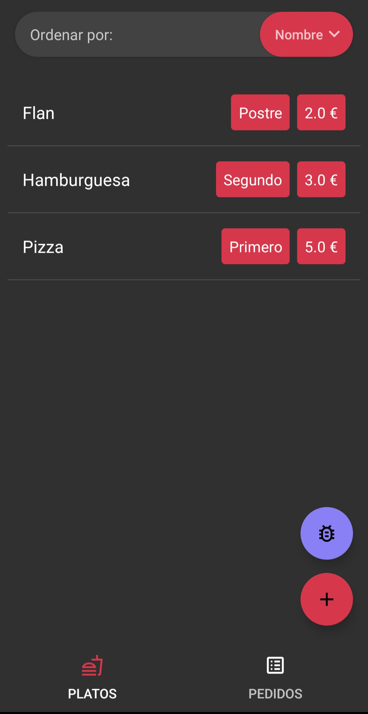
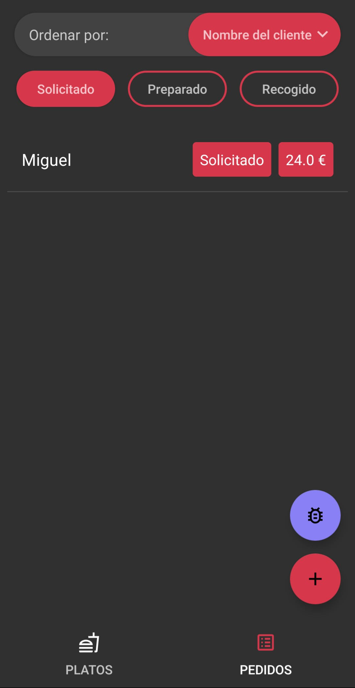

# RestauranteApp

**A native Android application designed for managing restaurant menus and tracking customer orders.**

This project is a complete local order management system. It allows a restaurant to maintain a digital catalog of its dishes, manage incoming customer orders through various preparation stages, and send automated updates directly to customers.

## Features

* **Dish Management:** Create, read, update, and delete dishes from the menu. Each dish includes a name, ingredients list, category (First Course, Second Course, Dessert), and price.
* **Order Tracking:** Create customer orders and track their lifecycle through three distinct states: Requested, Prepared, and Picked Up.
* **Dynamic Pricing:** The application automatically calculates the total price of an order based on the selected dishes and their respective quantities.
* **SMS Notifications:** Integrates direct SMS messaging to send order summaries and total pricing to the customer's mobile phone.

## Tech Stack

* **Platform:** Android (Local execution, no external server or internet connection required).
* **Database:** SQLite3 managed via the Room persistence library for robust local data storage.
* **Architecture:** Follows the Model-View-ViewModel (MVVM) pattern to strictly separate the user interface from the underlying data and business logic.
* **Design:** Built using Android Material Design guidelines, featuring tabbed navigation and native dark mode support.

## Academic Context

This project was developed as part of the **Ingeniería del Software** course (3rd Year, Computer Engineering Degree) at the **Universidad de Zaragoza** (Academic Year 2023-2024).

Developed by [@jaimea753](https://github.com/jaimea753) and [@miguelroyo18](https://github.com/miguelroyo18).
